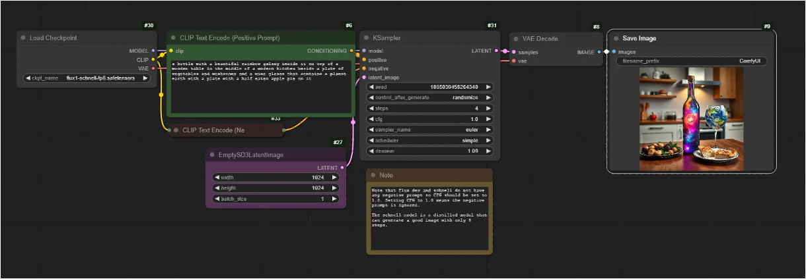

# #0. Overview

ComfyUI는 생성형 AI를 위한 노드 기반 인터페이스 및 추론 엔진입니다.

사용자는 노드를 통해 다양한 AI 모델과 작업을 결합하여 더 높은 수준의 맞춤형 및 제어 가능한 생성 파이프라인을 구현할 수 있습니다.

<figure><figcaption></figcaption></figure>

이번 실습에서는 AWS 환경에서 ComfyUI를 프로비저닝하고 활용합니다. ComfyUI를 AWS 환경에서 활용할 때 다양한 장점을 가져갈 수 있습니다.

1. 유연한 배포 옵션
   1. 단일 EC2 부터 컨테이너화 된 ECS/EKS까지 요구사항에 맞게 선택 가능
   2. 다양한 컴퓨팅 리소스를 워크로드에 맞춰 활용 가능
      1. CPU only / GPU
   3. Spot instance 활용으로 비용 절감 가능
2. 사용량 기반 비용
   1. 필요할 때만 리소스를 사용하고 비용 지불
3. 운영 및 관리
   1. 통합 환경에서 중앙화 된 운영 및 모니터링 가능
   2. IaC 기반 자동화 된 배포
4. 보안
   1. IAM 기반 접근 제어 및 Cognito, SAML 인증 통합
   2. 네트워크 분리
   3. IP 및 도메인 제한, WAF를 이용한 애플리케이션 보호
