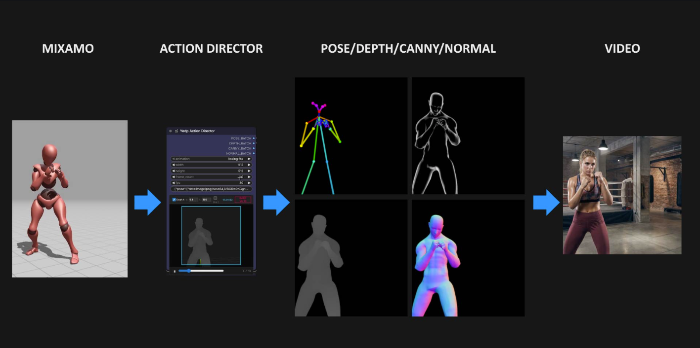
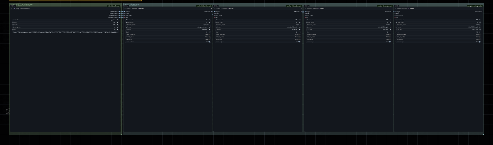
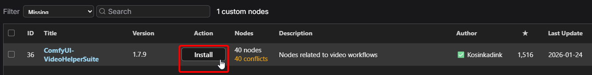
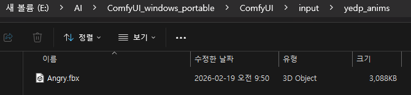
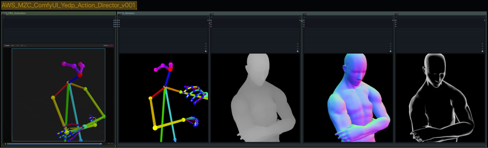
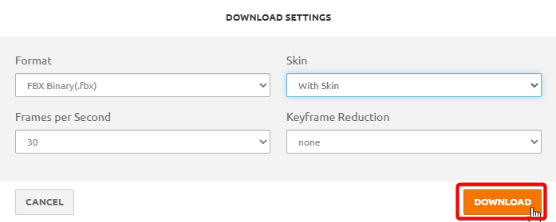
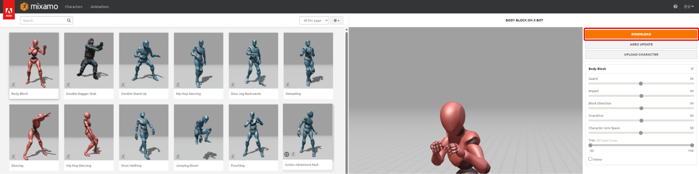
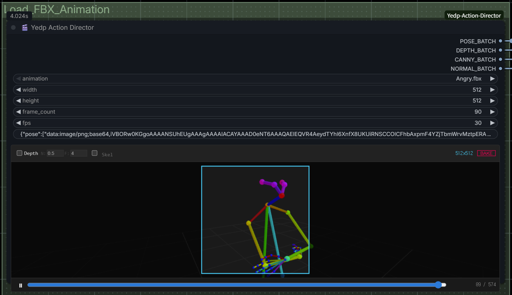
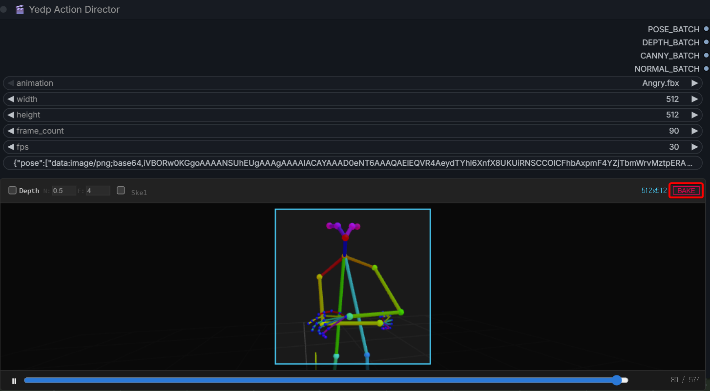
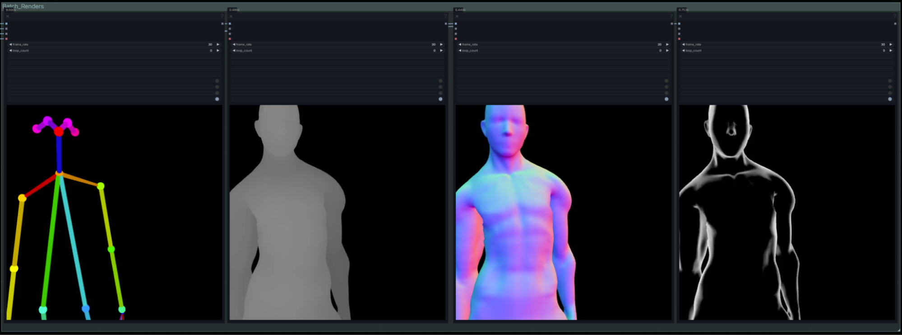

# #2-1. Yedp Action Director

FBX 혹은 GLB 포맷의 **3D 애니메이션 데이터**를 로딩하고 확인할 수 있는 뷰포트를 제공합니다. 카메라 레졸루션, Frame Count, FPS를 조정할 수 있으며 설정한 카메라 세팅으로 **Openpose, Depth, Canny, Normal** 컨트롤넷 패스를 렌더링할 수 있습니다.

Mixamo 애니메이션 데이터와 완벽하게 호환되며, 비디오 생성용 소스로 활용할 수 있습니다.

## 워크플로 로딩

1. 제공된 `AWS_MZC_Yedp_Action_Director.json` 워크플로를 로딩합니다.
2.  Missing Custom 노드를 설치합니다. ComfyUI Manager → **Install Missing Custom Nodes** 클릭.

    
3.  **ComfyUI-VideoHelperSuite**를 설치합니다.

    
4.  정상적으로 로딩된 워크플로를 확인합니다. 로딩할 애니메이션은 `..\ComfyUI\input\yedp_anims` 폴더에 존재해야 합니다.

    

    

## Mixamo 애니메이션 다운로드

1. https://www.mixamo.com/ 으로 이동하여 Adobe 계정으로 로그인합니다.
2.  원하는 애니메이션을 선택 후 **Download** 클릭 → 다운로드 세팅 확인 후 Download.

    

    
3. `..ComfyUI\input` 폴더에 `yedp_anims` 폴더를 생성하여 다운로드 받은 파일을 넣습니다.

## Yedp Action Director 노드 파라미터

| 파라미터           | 설명                         |
| -------------- | -------------------------- |
| animation      | 로딩할 애니메이션                  |
| width / height | 화면 너비/높이 값                 |
| frame\_count   | 로딩할 프레임 수                  |
| fps            | 프레임 레이트 설정값                |
| Depth (beta)   | 프리뷰를 Depth 컨트롤넷으로 변경       |
| N, F           | Near, Far - 적정한 Depth 값 설정 |
| Bake           | 프리뷰 화면 그대로 컨트롤넷 포즈를 베이킹    |

## 실행

1.  카메라를 세팅한 뒤 **Bake**를 클릭하여 베이킹합니다.

    
2.  **Run** 클릭 혹은 `Ctrl+Enter`로 Queue를 실행합니다. 각각 Openpose, Depth, Normal, Canny 컨트롤넷 비디오가 생성됩니다.

    
