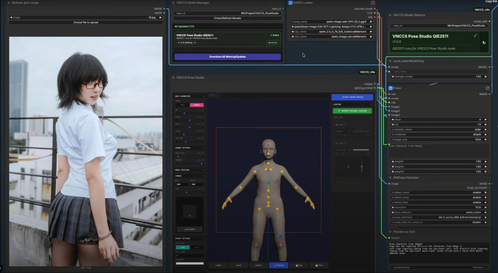
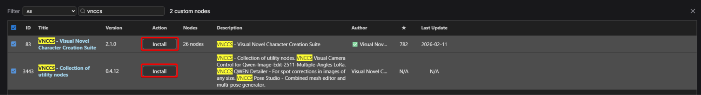
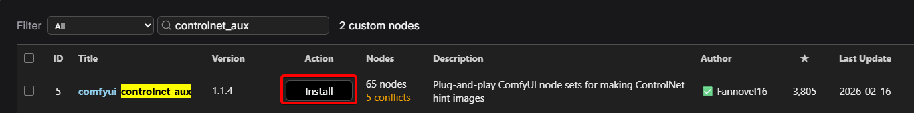
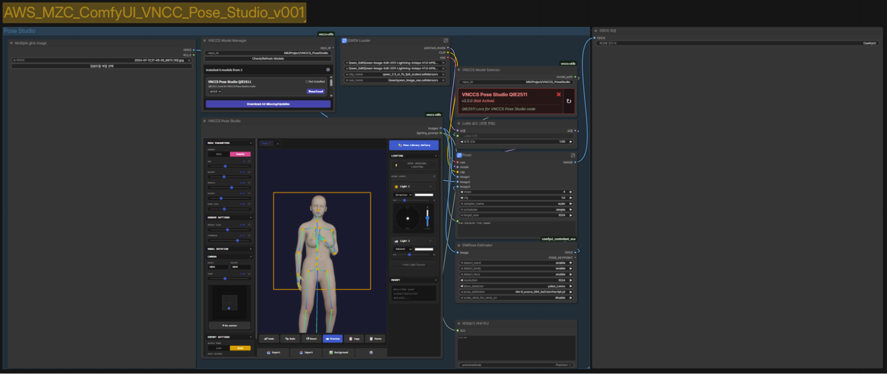
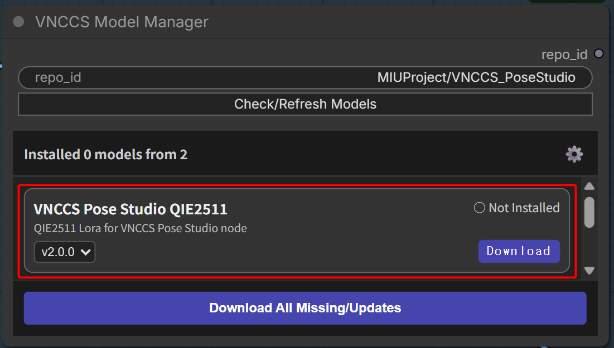
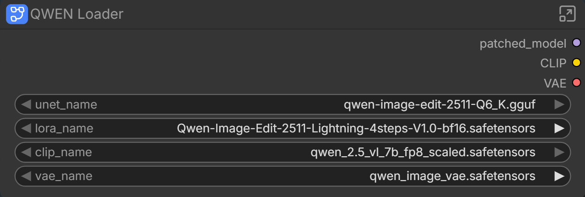
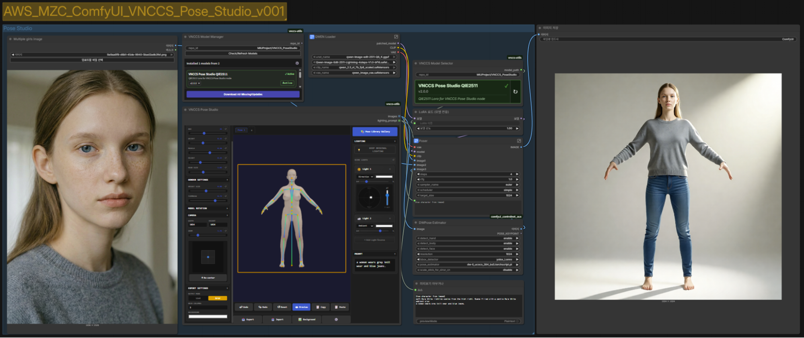
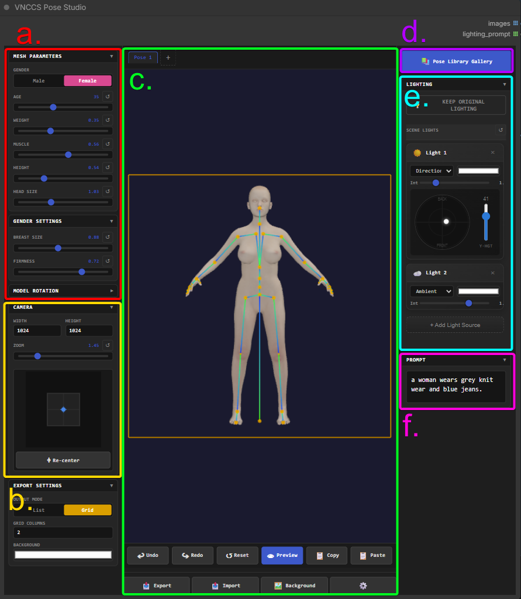

# #2-2. VNCCS Pose Studio

**VNCCS(Visual Novel Character Creation Suite) Pose Studio**는 인물의 포즈를 직관적으로 제어하고, 카메라를 자유롭게 세팅하며, 간단한 수준의 라이팅 세팅까지 가능한 ComfyUI의 포토 스튜디오입니다.

별도 툴 없이 ComfyUI 환경에서 3D 캐릭터의 포즈와 조명을 직접 세팅할 수 있는 내장 스튜디오를 제공합니다. 컴퓨터 비전 능력을 활용하여 타 방식보다 정밀한 디테일 수정이 가능하며, 직관적인 카메라 위젯이 지원됩니다.

## 설치

1.  ComfyUI Manager에서 `VNCCS` 검색 → **VNCCS - Visual Novel Character Creation Suite**와 **VNCCS - Collection of utility nodes** 설치.

    
2. **comfyui\_controlnet\_aux**와 **ComfyUI-GGUF**를 설치합니다.
3.  제공된 `AWS_MZC_VNCCS_Pose_Studio.json` 워크플로를 로딩합니다.

    

    

## 모델 다운로드

VNCCS Model Manager 노드에서 **VNCCS Pose Studio QIE2511**을 선택하여 다운로드합니다.

실습 시간 확보를 위해 **양자화된 모델**을 사용합니다:

| 모델                                                         | 다운로드 링크                                                        |
| ---------------------------------------------------------- | -------------------------------------------------------------- |
| qwen-Image-Edit-2511-Q6\_K.gguf                            | https://huggingface.co/unsloth/Qwen-Image-Edit-2511-GGUF       |
| Qwen-Image-Edit-2511-Lightning-4step-V1.0-bf16.safetensors | https://huggingface.co/lightx2v/Qwen-Image-Edit-2511-Lightning |
| qwen\_2.5\_vl\_7b\_fp8\_scaled.safetensors                 | https://huggingface.co/Comfy-Org/Qwen-Image\_ComfyUI           |
| qwen\_image\_vae.safetensors                               | https://huggingface.co/Comfy-Org/Qwen-Image\_ComfyUI           |

## 실행

1. `r`을 눌러 모델을 리프레쉬한 뒤, 모델들을 각각 불러옵니다.
2.  임의의 이미지를 로딩합니다. 간단한 프롬프트를 VNCCS Pose Studio 노드에 기입 후 Queue를 실행해 아웃풋을 확인합니다.

    

    

## VNCCS Pose Studio 노드 구성

| 영역         | 설명                                |
| ---------- | --------------------------------- |
| 3D 메쉬 파라미터 | 성별, 나이, 키 등의 세부 속성 제어             |
| 카메라 세팅     | 카메라 앵글 및 줌 제어                     |
| 3D 뷰어      | 3D 메쉬의 뼈대를 직관적으로 제어, JSON 익스포트 가능 |
| 포즈 갤러리     | 사전 제작된 포즈 라이브러리                   |
| 조명 제어      | 라이팅 세팅 패널                         |
| 프롬프트       | 메뉴얼 프롬프트 추가                       |

