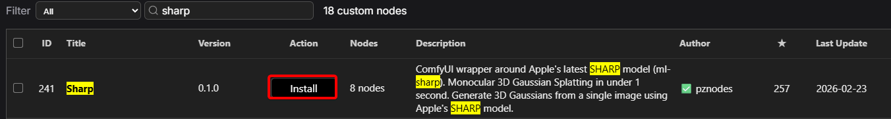
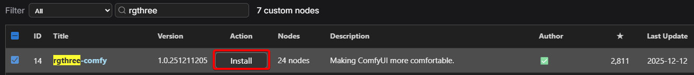
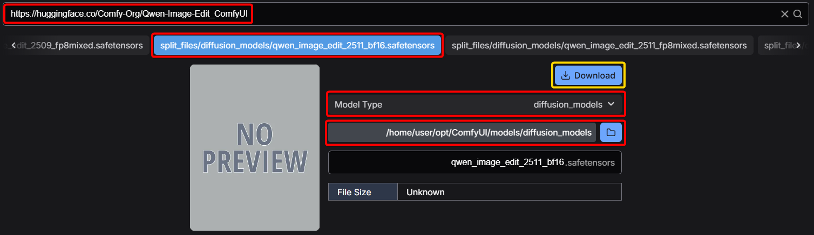
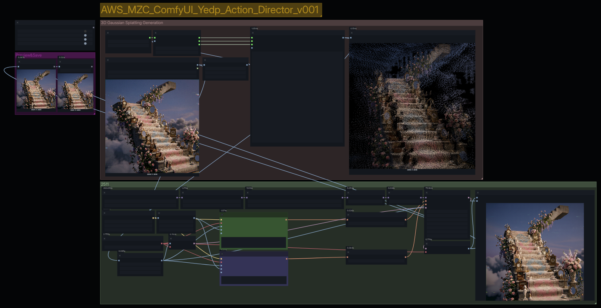
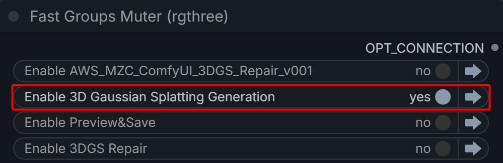
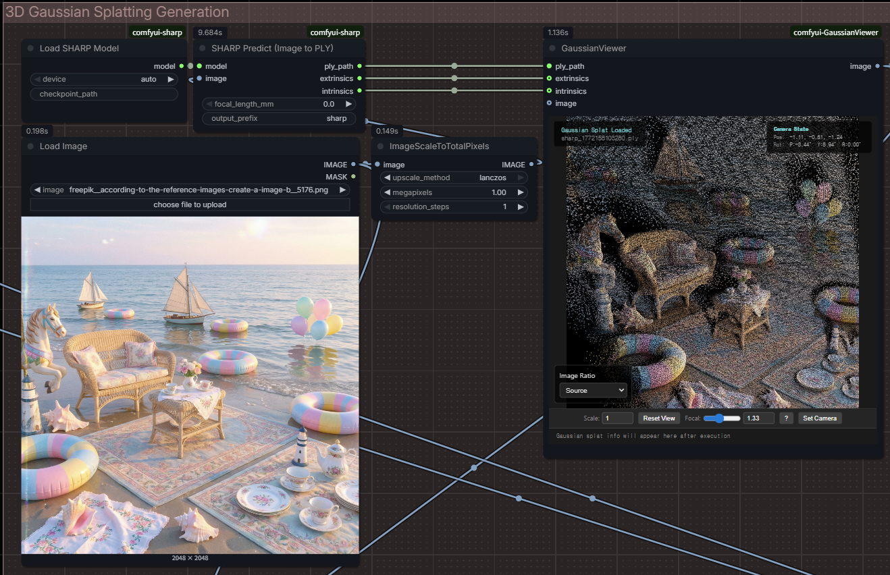
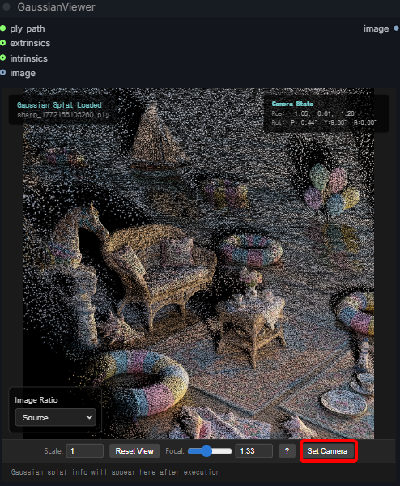
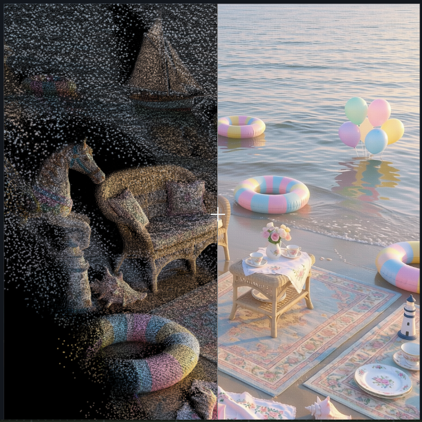
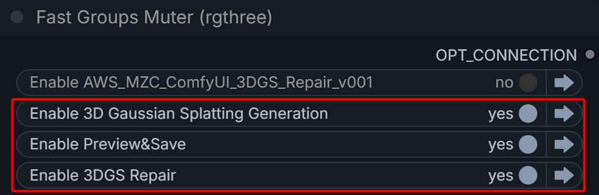

# #2-3. 3DGS 씬 재생성 및 수정

ComfyUI 용도로 wrapping된 Apple의 **Sharp 모델**을 활용하여 단일 이미지에서 **3D Gaussian Splatting** 씬을 생성합니다. 뷰포트에서 원하는 앵글과 줌을 설정한 뒤, 포인트 클라우드가 부족한 부분을 GenAI로 재생성해서 이미지를 복구하는 프로세스입니다.

단일 이미지처럼 한정된 비주얼 리소스를 기준으로 다양한 각도의 이미지를 생성하여 보다 정밀한 포인트 클라우드 파일을 생성할 수 있는 **학습 데이터셋 생성 프로세스**로 응용해볼 수 있습니다.

## 설치

1. ComfyUI Manager의 Custom Node Manager에서 `rgthree` 검색 → **rgthree-comfy** 설치.
2.  `sharp` 검색 → **Sharp** 설치.

    

    
3. 모델 다운로드:

| 모델                                        | 다운로드 링크                                                   |
| ----------------------------------------- | --------------------------------------------------------- |
| qwen\_image\_edit\_2511\_bf16.safetensors | https://huggingface.co/Comfy-Org/Qwen-Image-Edit\_ComfyUI |

## 워크플로 실행

1.  제공된 `AWS_MZC_3DGS_Repair.json` 워크플로를 로딩합니다.

    
2.  **Fast Group Muter**에서 `Enable 3D Gaussian Splatting Generation` 그룹만 활성화합니다.

    
3.  생성하고 싶은 이미지를 로딩한 뒤 Queue를 눌러 **PLY 파일**을 생성합니다.

    
4. 원하는 카메라를 세팅한 뒤 **Set Camera**를 클릭하여 카메라 파라미터를 고정합니다.
5.  Fast Groups Muter에서 **3D Gaussian Splatting Generation**, **3DGS Repair**, **Preview & Save** 그룹을 모두 활성화합니다.

    
6.  Queue를 실행하여 이미지를 생성합니다.

    

    
