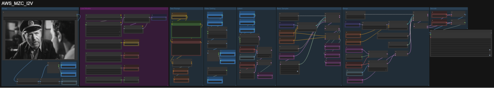

# #2-4-1. Image 2 Video (LTX2)

**LTX2 모델**은 비디오 + 오디오를 한 번에 생성하는 멀티모달 모델입니다. 오디오와 비디오가 같은 시간축을 공유하며, 이 둘을 함께 모달리티로 취급하는 점에서 현 시점 다른 오픈 웨이트 비디오 모델과 차별점이 있습니다.

이 워크플로는 기본에 충실한 LTX2 Image-to-Video 워크플로입니다.

## 모델 다운로드

Model Manager에서 다음 모델을 다운로드합니다:

| 모델                                                     | 다운로드 링크                                                                   |
| ------------------------------------------------------ | ------------------------------------------------------------------------- |
| LTX-2-Image2Vid-Adapter.safetensors                    | https://huggingface.co/MachineDelusions/LTX-2\_Image2Video\_Adapter\_LoRa |
| ltx-2-19b-ic-lora-detailer.safetensors                 | https://huggingface.co/Lightricks/LTX-2-19b-IC-LoRA-Detailer              |
| ltx-2-19b-distilled-fp8\_transformer\_only.safetensors | https://huggingface.co/Kijai/LTXV2\_comfy                                 |
| ltx-2-19b-embeddings\_connector\_bf16.safetensors      | https://huggingface.co/Kijai/LTXV2\_comfy                                 |
| LTX2\_audio\_vae\_bf16.safetensors                     | https://huggingface.co/Kijai/LTXV2\_comfy                                 |
| LTX2\_video\_vae\_bf16.safetensors                     | https://huggingface.co/Kijai/LTXV2\_comfy                                 |
| gemma\_3\_12B\_it\_fp8\_e4m3fn.safetensors             | https://huggingface.co/GitMylo/LTX-2-comfy\_gemma\_fp8\_e4m3fn            |
| ltx-2-spatial-upscaler-x2-1.0.safetensors              | https://huggingface.co/Lightricks/LTX-2                                   |

## 실행

1. 제공된 `AWS_MZC_I2V` 워크플로를 로딩합니다.
2.  Queue를 실행하여 아웃풋을 생성합니다.

    
