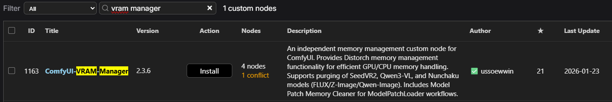
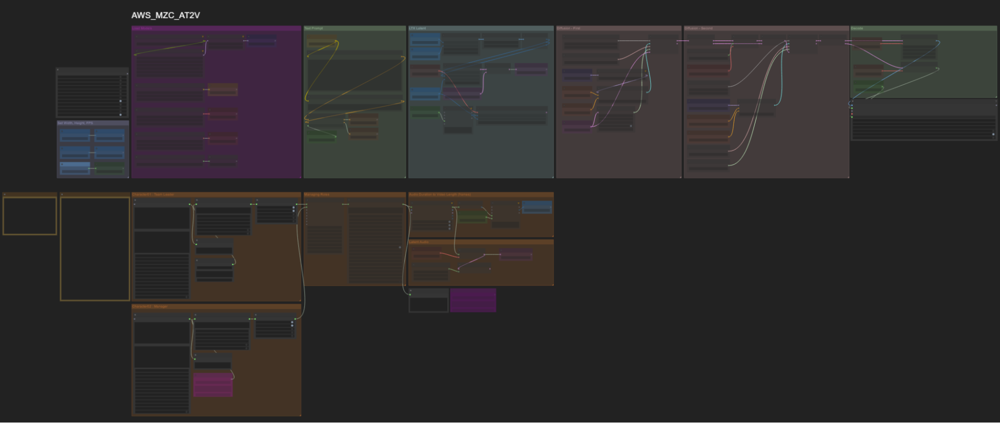
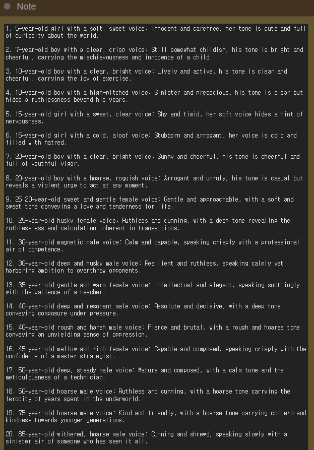
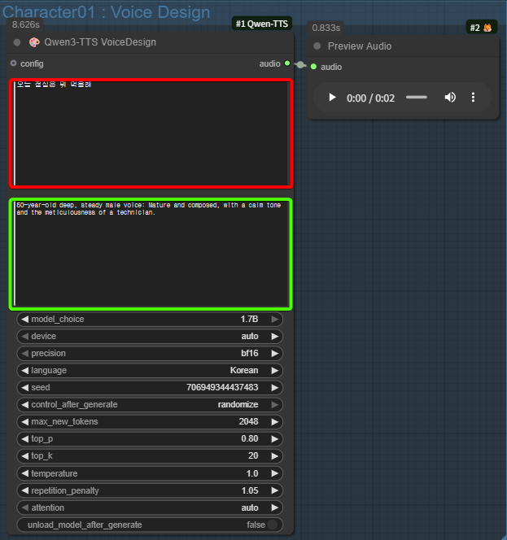
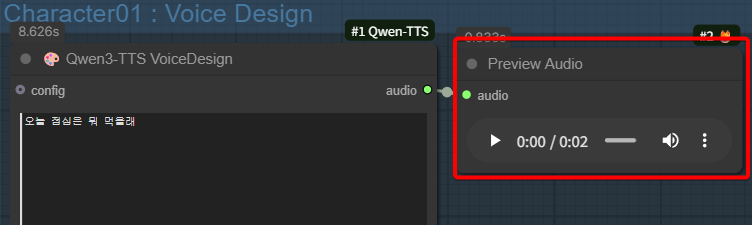
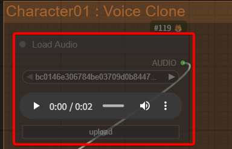
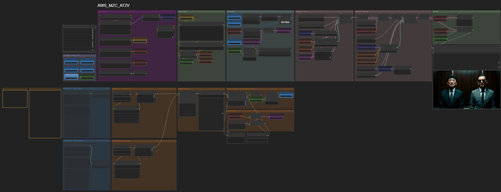

# #2-4-2. Audio + Text 2 Video (Qwen TTS + LTX2)

**Qwen TTS**와 **LTX2** 모델을 활용하여 커스텀 오디오와 비디오를 한 번에 생성하는 워크플로입니다.

Qwen TTS 모델을 활용하여 원하는 언어, 성별, 연령대, 목소리의 특징을 프롬프트화하여 커스텀하게 디자인할 수 있습니다. 녹음된 음성 파일을 리소스로 다른 대사를 말하도록 **클로닝**도 가능합니다.

이번 실습은 두 명의 인물/캐릭터를 등장시켜 각 롤을 부여한 **대화 형식의 비디오**를 생성합니다.

## 설치

ComfyUI Manager의 Custom Node Manager에서 다음 노드들을 설치합니다:

| 커스텀 노드                                |
| ------------------------------------- |
| Qwen3-TTS - Voice Synthesis & Cloning |
| ComfyUI-KJNodes                       |
| comfy-mtb                             |
| ComfyUI-Vram-Manager                  |



## 워크플로 흐름

```
Qwen-TTS로 목소리 생성 → Voice Cloning으로 프롬프트화
→ 각 캐릭터에 롤 부여 → 대화 형태 오디오로 컴바인
→ LTX2로 비디오 생성 → 오디오 + 비디오 디코딩 → 최종 아웃풋
```

## 보이스 디자인

1.  제공된 `AWS_MZC_AT2V` 워크플로를 로딩합니다.

    
2. **Character01: Voice Design**과 **Character02: Voice Design** 노드 그룹만 활성화합니다.
3.  **Qwen3-TTS VoiceDesign** 노드에서:

    * 위쪽 프롬프트란: 원하는 대사 입력
    * 아래 프롬프트란: 목소리의 특징 입력

    
4.  Queue를 클릭해 실행한 뒤 생성된 오디오를 확인합니다.

    

    

## 보이스 클로닝 & 비디오 생성

1.  생성된 오디오에 만족하면 다운로드 받은 뒤 **Character01: Voice Clone** 그룹의 Load Audio 노드에 업로드합니다. Character02도 동일하게 진행합니다.

    
2. Fast Group Muter에서 **Voice Design** 그룹을 비활성화하고 나머지 그룹을 모두 활성화합니다.
3.  Queue를 눌러 워크플로를 실행합니다.

    
