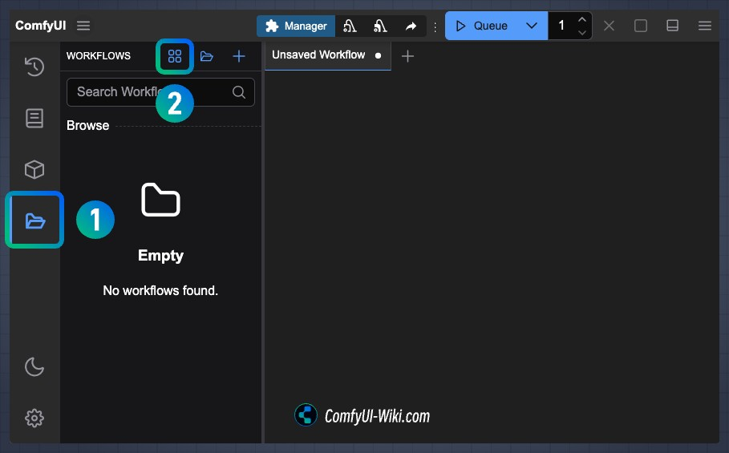
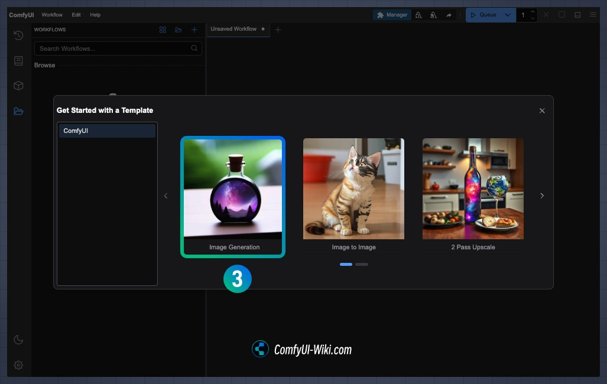
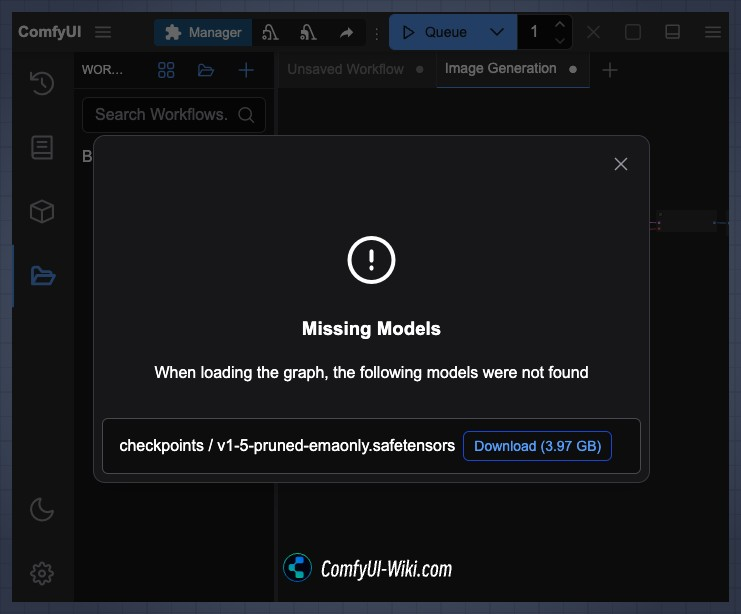
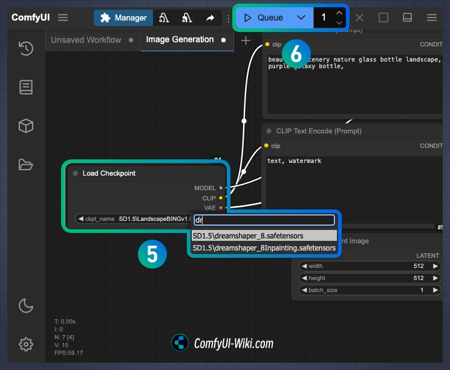
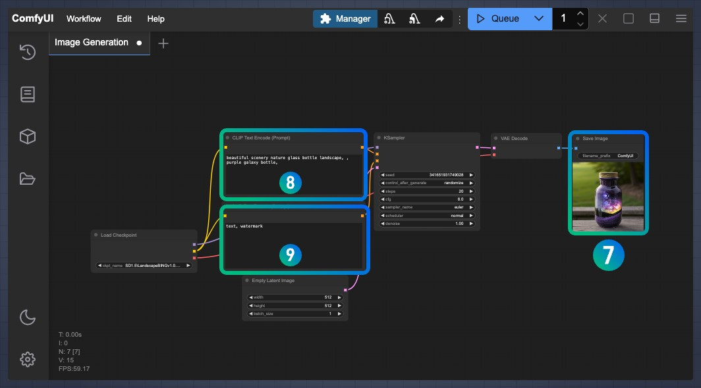

# #1-2-1. Text-to-Image

## 📚 학습 목표
- ComfyUI의 기본 노드들을 이해하고 연결하는 방법 익히기
- Text-to-Image 워크플로우를 직접 구성하고 실행하기
- 프롬프트 작성 기법과 파라미터 조정 방법 학습하기

## ⏱️ 소요 시간
약 45-60분

## 📊 난이도
⭐⭐☆☆☆ (초급)

---

Text-to-Image는 텍스트 프롬프트만으로 새로운 이미지를 생성하는 가장 기본적인 워크플로우입니다.

## 빌트인 워크플로우 불러오기

ComfyUI에는 기본 제공되는 워크플로우 템플릿이 있습니다. 좌측 **Workflow** 패널을 열어 빌트인 워크플로우를 확인할 수 있습니다.



**Image Generation** 카테고리에서 **Text to Image** 워크플로우를 선택하면 기본 Text-to-Image 워크플로우가 자동으로 로드됩니다.



> **Tip:** 빌트인 워크플로우를 사용하면 아래의 수동 구성 과정을 건너뛸 수 있습니다. 하지만 각 노드의 역할을 이해하기 위해 아래 단계별 가이드를 따라해 보는 것을 권장합니다.

## 워크플로우 구성

### 1단계: 빈 캔버스 준비

ComfyUI를 열면 빈 캔버스가 표시됩니다. 우클릭 또는 스페이스바를 눌러 노드 메뉴를 열 수 있습니다.

 (1).png>)

### 2단계: Checkpoint 로드 노드 배치

우클릭 → **Add Node** → **loaders** → **Load Checkpoint**

.png>)

**왜 이 노드가 필요한가?** AI 모델의 "두뇌"를 불러오는 단계입니다. 체크포인트는 수십억 개의 이미지로 학습된 모델 파일로, 이것이 있어야 이미지를 생성할 수 있습니다.

.png>)

### 3단계: CLIP 텍스트 인코딩 노드 배치 (2개)

우클릭 → **Add Node** → **conditioning** → **CLIP Text Encode (Prompt)**

두 개의 노드를 추가합니다:

* 하나는 **Positive Prompt** (원하는 것)
* 하나는 **Negative Prompt** (원하지 않는 것)

**왜 이 노드가 필요한가?** 사람의 언어를 AI가 이해할 수 있는 숫자 형태로 번역하는 "통역사" 역할을 합니다. Positive는 "이걸 그려줘", Negative는 "이건 그리지 마"를 의미합니다.

.png>)

### 4단계: 빈 잠재 이미지 노드 배치

우클릭 → **Add Node** → **latent** → **Empty Latent Image**

**왜 이 노드가 필요한가?** 조각가가 대리석 덩어리에서 시작하듯이, AI도 "랜덤 노이즈"라는 원재료에서 시작합니다. 이 노드는 그 원재료를 준비하는 단계입니다.

.png>)

기본 설정:

* **width**: 1024
* **height**: 1024
* **batch\_size**: 1

### 5단계: KSampler 노드 배치

우클릭 → **Add Node** → **sampling** → **KSampler**

**왜 이 노드가 필요한가?** 이것이 바로 "조각가"입니다! 랜덤 노이즈에서 점진적으로 불필요한 부분을 깎아내어 프롬프트에 맞는 이미지를 만들어냅니다. 가장 핵심적인 노드입니다.

.png>)

권장 설정:

* **seed**: 0 (또는 원하는 값)
* **steps**: 20
* **cfg**: 8.0
* **sampler\_name**: euler
* **scheduler**: simple
* **denoise**: 1.00

### 6단계: VAE Decode 및 이미지 미리보기 노드 배치

**VAE Decode 노드 추가:** 우클릭 → **Add Node** → **latent** → **VAE Decode**

**왜 이 노드가 필요한가?** KSampler가 만든 결과물은 아직 우리가 볼 수 없는 "압축된 형태"입니다. VAE Decode는 이것을 실제 이미지(픽셀)로 변환하는 "현상" 과정입니다.

.png>)

**이미지 미리보기 노드 추가:** 우클릭 → **Add Node** → **image** → **Preview Image**

**왜 이 노드가 필요한가?** 최종 결과물을 화면에 보여주는 "액자" 역할을 합니다.

.png>)

### 7단계: 노드 연결 (엣지 연결)

이제 모든 노드를 올바른 순서로 연결합니다:

.png>)

**연결 순서:**

1. **Load Checkpoint** → **CLIP Text Encode (Positive)**
   * `CLIP` 출력 → `clip` 입력
2. **Load Checkpoint** → **CLIP Text Encode (Negative)**
   * `CLIP` 출력 → `clip` 입력
3. **Load Checkpoint** → **KSampler**
   * `MODEL` 출력 → `model` 입력
4. **CLIP Text Encode (Positive)** → **KSampler**
   * `CONDITIONING` 출력 → `positive` 입력
5. **CLIP Text Encode (Negative)** → **KSampler**
   * `CONDITIONING` 출력 → `negative` 입력
6. **Empty Latent Image** → **KSampler**
   * `LATENT` 출력 → `latent_image` 입력
7. **KSampler** → **VAE Decode**
   * `LATENT` 출력 → `samples` 입력
8. **Load Checkpoint** → **VAE Decode**
   * `VAE` 출력 → `vae` 입력
9. **VAE Decode** → **Preview Image**
   * `IMAGE` 출력 → `images` 입력

.png>)

### 8단계: 체크포인트 다운로드

모델이 없는 경우 다운로드가 필요합니다.

워크플로우를 불러왔을 때 필요한 모델이 설치되어 있지 않으면 아래와 같은 알림이 표시됩니다:



**Manager를 통한 다운로드:**

1. 우측 **Manager** 버튼 클릭
2. **Model Manager** 선택
3. "sd\_xl\_base\_1.0" 검색
4. **Download** 클릭

.png>)

또는 직접 다운로드:

* [Stable Diffusion XL Base 1.0](https://huggingface.co/stabilityai/stable-diffusion-xl-base-1.0)에서 다운로드
* `/workspace/models/checkpoints/` 폴더에 저장

다운로드 후 **Load Checkpoint** 노드에서 모델을 선택합니다.

.png>)

### 9단계: Positive Prompt 작성

**CLIP Text Encode (Positive)** 노드의 텍스트 필드에 프롬프트를 입력합니다:

**영어 예시:**
```
beautiful scenery nature glass bottle landscape, purple galaxy bottle,
```

**한국어 친화적 예시:**
```
아름다운 자연 풍경, 유리병 속 보라색 은하수, 환상적인 분위기, 고품질 디지털 아트
```

.png>)

**프롬프트 작성 팁:**

* 구체적이고 명확한 단어 사용
* 쉼표로 키워드 구분
* 형용사로 스타일 지정 (예: "cinematic", "photorealistic", "artistic")
* 중요한 키워드는 앞쪽에 배치

> **초보자 팁:** 영어 프롬프트가 더 정확하지만, 한국어도 대부분의 SDXL 모델에서 잘 작동합니다. 영어가 어렵다면 한국어로 시작해도 괜찮습니다!

### 10단계: Negative Prompt 작성

**CLIP Text Encode (Negative)** 노드의 텍스트 필드에 제외할 요소를 입력합니다:

**영어 예시:**
```
text, watermark, blurry, low quality
```

**한국어 예시:**
```
글자, 워터마크, 흐릿한, 저화질, 왜곡된
```

.png>)

**일반적인 Negative Prompt:**

* `text, watermark`: 텍스트/워터마크 제거
* `blurry, low quality`: 품질 저하 방지
* `deformed, distorted`: 왜곡 방지
* `extra limbs, bad anatomy`: 해부학적 오류 방지 (인물 이미지용)

> **초보자 팁:** Negative Prompt는 "이것만은 피해줘!"라고 말하는 것입니다. 처음에는 기본적인 `text, watermark, low quality` 정도만 써도 충분합니다.

## 실행 및 결과 확인

모든 설정이 완료되었으면 우측 상단의 **Queue Prompt** 버튼을 클릭합니다.

.png>)

**Load Checkpoint** 노드에서 원하는 모델을 선택하고 **Run** 버튼을 눌러 이미지를 생성합니다.



생성 과정이 진행되며 각 노드가 순차적으로 실행됩니다.

.png>)

완료되면 **Preview Image** 노드에 생성된 이미지가 표시됩니다.

.png>)



## 파라미터 조정

### 파라미터 빠른 참고표

| 파라미터 | 권장 범위 | 효과 | 초보자 권장값 |
|---------|---------|------|-------------|
| **Steps** | 20-30 | 생성 품질 (높을수록 정교, 느림) | 25 |
| **CFG Scale** | 7-9 | 프롬프트 준수도 (높을수록 충실) | 8.0 |
| **Seed** | 0-999999 | 랜덤 시드 (같은 값 = 같은 결과) | 랜덤 |
| **Width/Height** | 1024x1024 | 이미지 해상도 (SDXL 기준) | 1024x1024 |

### Seed 값 변경

동일한 프롬프트로 다른 이미지를 생성하려면 **seed** 값을 변경합니다.

* 같은 seed = 같은 결과 (재현 가능)
* 다른 seed = 다른 이미지

.png>)

> **초보자 팁:** 마음에 드는 이미지가 나왔다면 seed 값을 메모해두세요. 나중에 같은 seed와 프롬프트를 사용하면 똑같은 이미지를 다시 만들 수 있습니다!

### Steps 조정

**steps** 값을 높이면 더 정교한 이미지를 얻을 수 있지만 생성 시간이 증가합니다.

* 낮은 값 (10\~15): 빠르지만 거친 결과
* 적정 값 (20\~30): 품질과 속도의 균형 ⭐ 권장
* 높은 값 (40\~50): 고품질이지만 느림

.png>)

### CFG Scale 조정

**cfg** (Classifier Free Guidance) 값은 프롬프트 준수 강도를 조절합니다.

* 낮은 값 (3\~5): 창의적이지만 프롬프트 이탈 가능
* 적정 값 (7\~9): 균형잡힌 결과 ⭐ 권장
* 높은 값 (12\~15): 프롬프트에 강하게 종속, 과포화 가능

.png>)

> **초보자 팁:** Steps는 "얼마나 정교하게?", CFG는 "얼마나 충실하게?" 프롬프트를 따를지를 결정합니다. 처음에는 Steps=25, CFG=8로 시작하세요!

### 해상도 변경

**Empty Latent Image** 노드의 **width**와 **height**를 조정하여 해상도를 변경할 수 있습니다.

.png>)

**권장 해상도 (SDXL):**

* 1024x1024 (정사각형)
* 1152x896 (가로)
* 896x1152 (세로)
* 1216x832 (와이드)

## 워크플로우 저장

완성된 워크플로우를 저장하여 나중에 재사용할 수 있습니다:

1. 우측 상단 **Save** 버튼 클릭
2. 파일명 입력 (예: `text2img_basic.json`)
3. 저장 완료

불러오기:

1. 우측 상단 **Load** 버튼 클릭
2. 저장된 워크플로우 선택

## 진행 확인

다음 단계로 넘어가기 전에 확인하세요:

- [ ] 6가지 핵심 노드(Load Checkpoint, CLIP Text Encode x2, Empty Latent Image, KSampler, VAE Decode, Preview Image)의 역할을 이해했나요?
- [ ] 노드를 올바르게 연결하여 워크플로우를 완성했나요?
- [ ] 첫 번째 이미지 생성에 성공했나요?
- [ ] Seed, Steps, CFG 파라미터를 변경하며 실험해봤나요?

## 다음 단계

Text-to-Image 워크플로우를 익혔다면 [Image-to-Image Workflow](2-2-image-to-image.md)로 이동하여 기존 이미지를 변형하는 방법을 학습하세요.

> 이미지 출처: [ComfyUI Wiki](https://comfyui-wiki.com)
