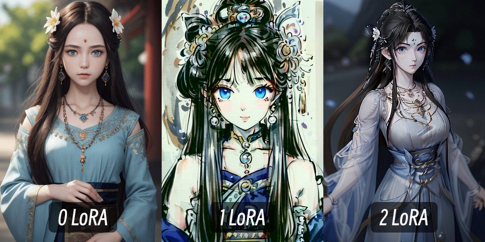

# #1-3. LoRA 실습



## LoRA란 무엇인가?

LoRA(Low-Rank Adaptation)는 기존 체크포인트 모델을 교체하지 않고 특정 스타일이나 캐릭터를 추가할 수 있는 경량 모델입니다.

### LoRA의 특징

* **작은 파일 크기**: 수십\~수백 MB로 전체 체크포인트(수 GB)보다 훨씬 작습니다
* **조합 가능**: 여러 개의 LoRA를 동시에 사용하여 다양한 효과를 혼합할 수 있습니다
* **필터 개념**: 이미지에 특정 스타일, 콘텐츠, 세부사항을 추가하는 "필터"처럼 작동합니다
* **효율적**: 전체 모델을 재학습하지 않고도 특정 특성을 추가할 수 있습니다

## LoRA 모델 준비

실습에 필요한 모델들을 다운로드합니다:

| 모델 유형    | 모델 이름           | 다운로드 링크                                                     |
| -------- | --------------- | ----------------------------------------------------------- |
| SD1.5 모델 | DreamShaper v8  | https://civitai.com/models/4384?modelVersionId=128713       |
| LoRA 모델  | MoXin (수묵화 스타일) | https://civitai.com/models/12597/moxin?modelVersionId=14856 |
| LoRA 모델  | QingYi          | https://civitai.com/models/383239?modelVersionId=427733     |

**저장 경로**: `ComfyUI/models/loras/`

## 실습 1: 단일 LoRA 적용

### Step 1: 기본 워크플로우 준비

* 기본 txt2img 워크플로우를 불러옵니다
* Load Checkpoint, CLIP Text Encode, KSampler, VAE Decode 노드가 연결되어 있어야 합니다

### Step 2: Load LoRA 노드 추가

1. 캔버스에서 더블클릭
2. 검색창에 "Load LoRA" 입력
3. Load LoRA 노드 선택

### Step 3: 연결 설정

1. **Load Checkpoint의 MODEL 출력** → **Load LoRA의 model 입력** 연결
2. **Load Checkpoint의 CLIP 출력** → **Load LoRA의 clip 입력** 연결
3. **Load LoRA의 MODEL 출력** → **KSampler의 model 입력** 연결
4. **Load LoRA의 CLIP 출력** → **CLIP Text Encode(positive)의 clip 입력** 연결

### Step 4: LoRA 모델 선택

1. Load LoRA 노드에서 LoRA 모델 선택 (예: MoXin)
2. `strength_model` 값 설정 (기본 1.0)
3. `strength_clip` 값 설정 (기본 1.0)

### Step 5: 프롬프트 입력 및 실행

1. Positive 프롬프트: `a beautiful landscape with mountains and rivers, traditional chinese painting style`
2. Negative 프롬프트: `ugly, blurry, low quality`
3. Queue Prompt 클릭하여 실행

## 실습 2: LoRA Stacking (여러 LoRA 겹치기)

여러 LoRA를 겹쳐서 사용하면 더욱 독특하고 복합적인 스타일을 만들 수 있습니다.

### Step 1: 첫 번째 LoRA 설정

1. 첫 번째 Load LoRA 노드에 **MoXin LoRA** 로드
2. `strength_model`: 0.5로 설정
3. `strength_clip`: 0.5로 설정

### Step 2: 두 번째 LoRA 추가

1. 캔버스에 두 번째 **Load LoRA 노드** 추가
2. **첫 번째 Load LoRA의 MODEL 출력** → **두 번째 Load LoRA의 model 입력** 연결
3. **첫 번째 Load LoRA의 CLIP 출력** → **두 번째 Load LoRA의 clip 입력** 연결

### Step 3: 두 번째 LoRA 설정

1. 두 번째 Load LoRA 노드에 **QingYi LoRA** 로드
2. `strength_model`: 0.3으로 설정
3. `strength_clip`: 0.3으로 설정

### Step 4: KSampler 연결

1. **두 번째 Load LoRA의 MODEL 출력** → **KSampler의 model 입력** 연결
2. **두 번째 Load LoRA의 CLIP 출력** → **CLIP Text Encode의 clip 입력** 연결

### Step 5: 실행 및 비교

1. 프롬프트 입력 후 실행
2. 단일 LoRA와 Stacking 결과 비교
3. 가중치를 조정하며 다양한 조합 실험

## LoRA 가중치 조정 팁

LoRA의 효과를 제어하는 가중치 값에 대한 가이드:

* **1.0**: LoRA 효과 최대 적용
* **0.5**: 중간 정도의 효과
* **0.2 이하**: 미세한 효과만 적용
* **주의**: 너무 높은 값(1.5 이상)은 이미지를 깨뜨릴 수 있습니다

### 가중치 조정 실험 예시

| MoXin 가중치 | QingYi 가중치 | 예상 효과              |
| --------- | ---------- | ------------------ |
| 1.0       | 0.0        | 순수 수묵화 스타일         |
| 0.5       | 0.5        | 균형 잡힌 혼합 스타일       |
| 0.3       | 0.7        | QingYi 스타일 강조      |
| 0.8       | 0.2        | 수묵화 중심, 약간의 QingYi |

## SDXL Style LoRA / LCM LoRA 소개

### SDXL Style LoRA

* SDXL 모델 전용 LoRA
* 특정 아트스타일을 적용할 수 있습니다
* SD1.5 LoRA보다 더 정교한 스타일 제어 가능

### LCM LoRA (Latent Consistency Model)

* **생성 속도 향상**: 생성 스텝을 4\~8스텝으로 대폭 줄입니다
* **빠른 프로토타이핑**: 아이디어를 빠르게 테스트할 때 유용합니다

#### LCM LoRA 사용 시 설정

KSampler 노드에서 다음과 같이 설정:

* `sampler`: **lcm**
* `steps`: **4\~8**
* `cfg`: **1.5\~2.0** (낮게 설정)
* `scheduler`: **sgm\_uniform** 또는 **simple**

## 실습 예제 프롬프트

### 수묵화 스타일 (MoXin LoRA)

```
Positive: a serene mountain landscape, misty valleys, traditional chinese ink painting, masterpiece, best quality
Negative: color, colorful, modern, photo, realistic
```

### 캐릭터 스타일 (QingYi LoRA)

```
Positive: 1girl, traditional chinese dress, elegant pose, detailed face, best quality
Negative: ugly, deformed, blurry, bad anatomy
```

### 혼합 스타일 (MoXin + QingYi)

```
Positive: 1girl in traditional chinese dress, mountain landscape background, ink painting style, elegant, masterpiece
Negative: ugly, blurry, bad quality, modern
```

## 추가 학습 자료

* ComfyUI Wiki LoRA 가이드: https://comfyui-wiki.com/ko/tutorial/basic/lora
* CivitAI LoRA 모델 검색: https://civitai.com/models?type=LORA
* LoRA 제작 가이드: Kohya\_ss 또는 Dreambooth 학습 도구 사용

## 다음 단계

LoRA를 마스터했다면 다음 주제로 넘어갑니다:

* **ControlNet**: 이미지 구조와 포즈 제어
* **IP-Adapter**: 스타일 참조 이미지 활용
* **Upscaling**: 고해상도 이미지 생성

> 이미지 출처: [ComfyUI Wiki](https://comfyui-wiki.com)
