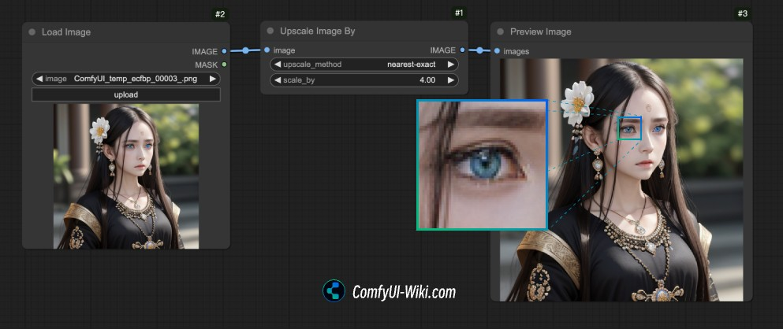
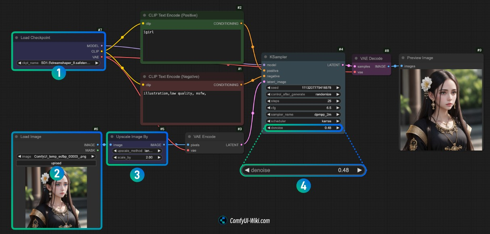
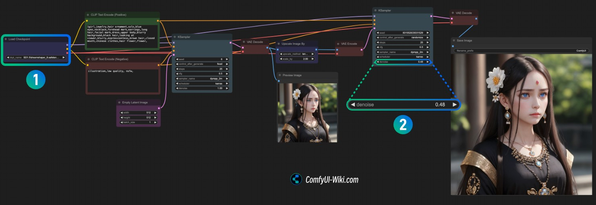
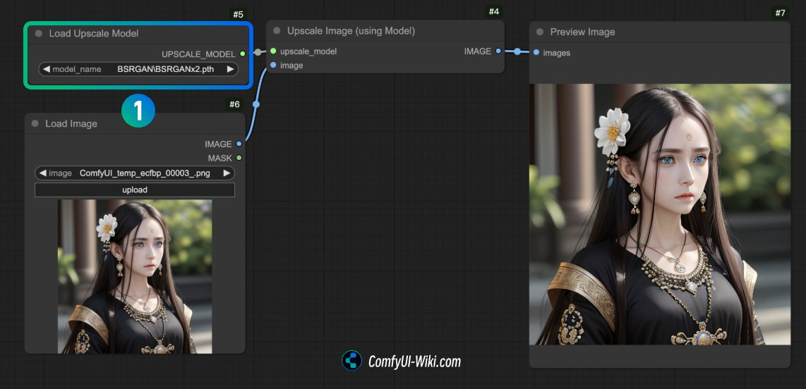

# #1-4-2. Upscaler

## 학습 목표
이 실습을 완료하면 다음을 할 수 있습니다:
- 이미지 업스케일링의 3가지 방식과 차이점 이해하기
- CCSR과 SUPIR 모델을 사용하여 고품질 업스케일링 수행하기
- Ultrasharp 4x 모델로 빠른 업스케일링 구현하기
- 상황에 맞는 업스케일링 방법 선택하기

## 소요 시간
약 15분

## 난이도
★★☆ (중급)

## Image Super Resolution 개념

Image Super Resolution(이미지 초해상도)은 저해상도 이미지를 고해상도로 변환하는 기술입니다. Stable Diffusion으로 생성한 이미지의 품질을 한 단계 끌어올리는 필수 후처리 과정입니다.

## 3가지 업스케일링 방식



### 업스케일링 방식 비교표

| 방식 | 속도 | 품질 | VRAM | 새 디테일 생성 | 추천 용도 |
|------|------|------|------|--------------|----------|
| 1. 픽셀 리샘플링 | ⚡⚡⚡ 매우 빠름 | ★☆☆ | 매우 낮음 | ❌ | 빠른 프리뷰, 크기만 키우기 |
| 2. SD 이차 샘플링 | ⚡⚡ 빠름 | ★★☆ | 중간 | ✅ (불안정) | 창의적 디테일 추가 |
| 3. CCSR/SUPIR | ⚡ 느림 | ★★★ | 높음 | ✅ (안정적) | 최종 결과물, 최고 품질 |

### 1. 픽셀 리샘플링 (Nearest/Bilinear/Lanczos)

* **장점**: 매우 빠른 처리 속도
* **단점**: 품질 제한, 새로운 디테일 생성 불가
* **용도**: 빠른 프리뷰, 간단한 크기 조정

### 2. SD 잠재 공간 이차 샘플링

* **장점**: 디테일 추가 가능
* **단점**: 원본 이미지와 일관성이 떨어질 수 있음
* **용도**: 창의적인 디테일이 필요한 경우

### 3. 업스케일 모델 기반 (CCSR/SUPIR)

* **장점**: 가장 높은 품질, 디테일 복원 우수
* **단점**: 처리 시간이 길고 VRAM 사용량이 높음
* **용도**: 최종 출력물, 고품질 이미지 필요 시

> **초보자 팁**: 처음에는 **Ultrasharp 4x**로 시작하세요. 가장 빠르고 안정적이며, 대부분의 경우 충분한 품질을 제공합니다. 정말 중요한 최종 결과물에만 CCSR이나 SUPIR을 사용하세요.

***

## CCSR (Content Consistent Super Resolution)

CCSR은 일관성 있는 콘텐츠 복원에 초점을 맞춘 업스케일링 모델입니다.

* **특징**: 원본 이미지의 구조와 콘텐츠를 유지하면서 해상도 향상
* **커스텀 노드**: `kijai/ComfyUI-CCSR`
* **GitHub**: https://github.com/kijai/ComfyUI-CCSR

## SUPIR (Scaling Up to Excellence)

SUPIR은 디테일 향상과 품질 개선에 특화된 업스케일링 모델입니다.

* **특징**: 미세한 디테일 복원 및 생성, 텍스처 품질 향상
* **커스텀 노드**: `kijai/ComfyUI-SUPIR`
* **GitHub**: https://github.com/kijai/ComfyUI-SUPIR

***

## 실습: CCSR + SUPIR 업스케일링

### Step 1: 커스텀 노드 설치

1. ComfyUI Manager 열기 (우측 하단 **Manager** 버튼)
2. **Custom Nodes Manager** 클릭
3. 검색창에 `ComfyUI-CCSR` 입력 → **Install** 클릭
4. 검색창에 `ComfyUI-SUPIR` 입력 → **Install** 클릭
5. ComfyUI **재시작**

### Step 2: 모델 다운로드

**CCSR 모델**:

| 모델 파일                 | 저장 경로                         | 다운로드                                                                                   |
| --------------------- | ----------------------------- | -------------------------------------------------------------------------------------- |
| real-world\_ccsr.ckpt | `ComfyUI/models/checkpoints/` | [HuggingFace](https://huggingface.co/camenduru/CCSR/resolve/main/real-world_ccsr.ckpt) |

**SUPIR 모델**:

| 모델 파일          | 저장 경로                         | 다운로드                                                                              |
| -------------- | ----------------------------- | --------------------------------------------------------------------------------- |
| SUPIR-v0Q.ckpt | `ComfyUI/models/checkpoints/` | [HuggingFace](https://huggingface.co/camenduru/SUPIR/resolve/main/SUPIR-v0Q.ckpt) |
| SUPIR-v0F.ckpt | `ComfyUI/models/checkpoints/` | [HuggingFace](https://huggingface.co/camenduru/SUPIR/resolve/main/SUPIR-v0F.ckpt) |

> **참고**: SUPIR-v0Q는 품질(Quality) 중심, SUPIR-v0F는 충실도(Fidelity) 중심 모델입니다. 용도에 맞게 선택하세요.

### Step 3: 워크플로우 구성

1. **새 캔버스 생성**
   * 좌측 상단 메뉴 → New
2. **이미지 로드 노드 추가**
   * 우클릭 → Add Node → image → **Load Image**
   * 업스케일할 저해상도 이미지 업로드


3. **CCSR 업스케일 노드 추가**
   * 우클릭 → Add Node → CCSR → **CCSR Upscale**
   * 모델 로드 노드 추가 → CCSR 모델 선택
4. **SUPIR 노드 추가** (선택사항)
   * 우클릭 → Add Node → SUPIR → **SUPIR Stage1**
   * 우클릭 → Add Node → SUPIR → **SUPIR Sampler**
5. **이미지 비교 노드 추가**
   * 우클릭 → Add Node → image → **Preview Image**
   * (Optional) rgthree-comfy의 **Image Comparer** 노드 추가

### Step 4: 노드 연결

```
이미지 로드 
  ↓
CCSR 업스케일
  ↓
SUPIR Stage1 (선택)
  ↓
SUPIR Sampler (선택)
  ↓
이미지 미리보기 / Image Comparer
```

### Step 5: CCSR 파라미터 설정

| 파라미터             | 권장값     | 설명                      |
| ---------------- | ------- | ----------------------- |
| scale            | 2 또는 4  | 업스케일 배율                 |
| steps            | 10\~20  | 생성 스텝 수 (높을수록 품질↑, 속도↓) |
| t\_max           | 0.6667  | 최대 타임스텝 (기본값 권장)        |
| t\_min           | 0.3333  | 최소 타임스텝 (기본값 권장)        |
| color\_fix\_type | wavelet | 색상 보정 방식 (wavelet 권장)   |

### Step 6: 실행 및 비교

1. **Queue Prompt** 버튼 클릭
2. 처리 완료 후 원본과 업스케일된 이미지 비교
3. 파라미터 조정하여 최적의 결과 도출
4. g4dn.xlarge 기준 약 2\~3분 소요

***

## 간단한 대안: Ultrasharp 4x 모델

VRAM이 부족하거나 빠른 업스케일링이 필요한 경우 **Ultrasharp 4x** 모델을 권장합니다.

### 설치 및 사용

1. **모델 다운로드**
   * ComfyUI Manager → **Model Manager** 열기
   * 검색창에 `ultrasharp` 입력
   * **4x-Ultrasharp** 모델 다운로드
   * 저장 경로: `ComfyUI/models/upscale_models/`
2.  **워크플로우 구성**

    ```
    이미지 로드
      ↓
    Upscale Model Loader (4x-Ultrasharp 선택)
      ↓
    Upscale Image Using Model
      ↓
    이미지 미리보기
    ```
3. **노드 추가 방법**
   * 우클릭 → Add Node → loaders → **Load Upscale Model** → `4x-Ultrasharp` 선택
   * 우클릭 → Add Node → image → upscaling → **Upscale Image (Using Model)**
   * Load Upscale Model의 출력을 Upscale Image의 `upscale_model`에 연결
   * Load Image의 출력을 Upscale Image의 `image`에 연결
4. **장점**
   * 낮은 VRAM 요구사항 (2\~3GB)
   * 빠른 처리 속도 (5\~10초)
   * 안정적인 결과

***

## 워크플로우 참조

### SD 이차 샘플링 확대 워크플로우



### 텍스트-이미지 생성 후 직접 확대 워크플로우



### 확대 모델 사용 워크플로우



***

## 방식별 비교 요약

| 방식            | 속도      | 품질    | VRAM | 추천 상황      |
| ------------- | ------- | ----- | ---- | ---------- |
| Ultrasharp 4x | ⚡ 매우 빠름 | ★★★   | 낮음   | 빠른 업스케일    |
| CCSR          | 보통      | ★★★★  | 중간   | 콘텐츠 일관성 유지 |
| SUPIR         | 느림      | ★★★★★ | 높음   | 최고 품질 필요 시 |
| CCSR + SUPIR  | 매우 느림   | ★★★★★ | 높음   | 최종 결과물     |

## 트러블슈팅

### VRAM 부족 오류

* Ultrasharp 4x로 전환
* 입력 이미지 해상도 줄이기
* scale을 4 대신 2로 설정

### 색상이 변하는 경우

* `color_fix_type`을 `wavelet`으로 설정
* CCSR의 `t_max`, `t_min` 값 조정

## 진행 확인

다음 항목을 완료했는지 체크하세요:

- [ ] 3가지 업스케일링 방식의 차이점을 이해했다
- [ ] Ultrasharp 4x 모델로 빠른 업스케일링을 성공적으로 수행했다
- [ ] CCSR 또는 SUPIR 모델을 설치하고 사용해봤다 (선택사항)
- [ ] 다양한 scale 값(2x, 4x)을 실험해봤다
- [ ] 원본과 업스케일된 이미지를 비교하며 품질 차이를 확인했다

## 참조

* [ComfyUI Wiki - Upscale Image](https://comfyui-wiki.com/ko/tutorial/basic/upscale-image)
* [CCSR GitHub](https://github.com/kijai/ComfyUI-CCSR)
* [SUPIR GitHub](https://github.com/kijai/ComfyUI-SUPIR)

> 이미지 출처: [ComfyUI Wiki](https://comfyui-wiki.com)
