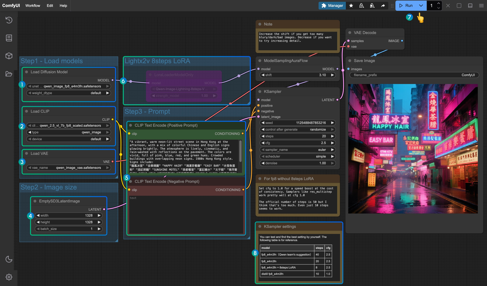
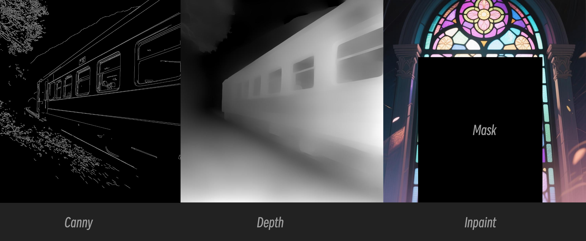
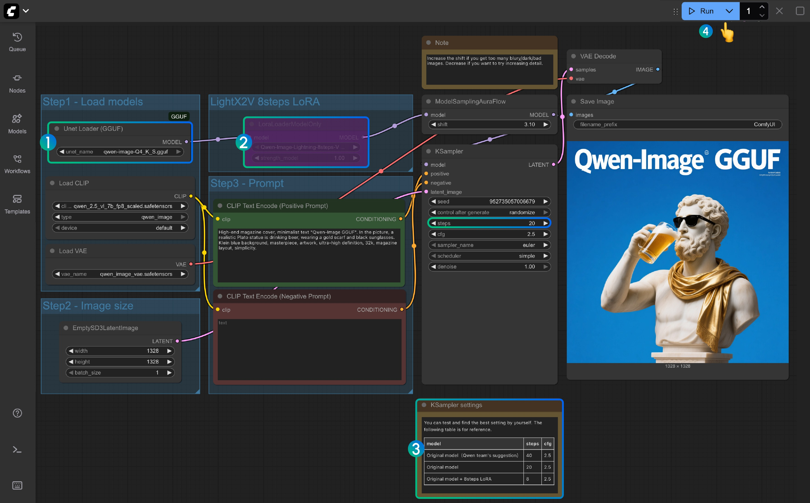
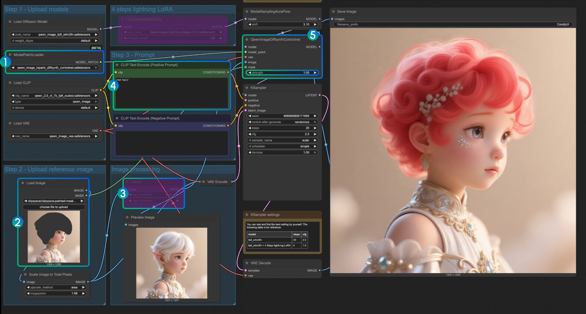
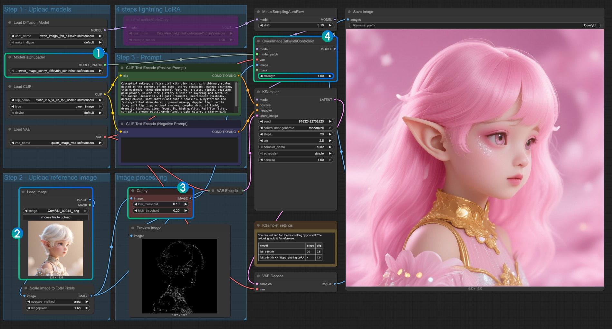
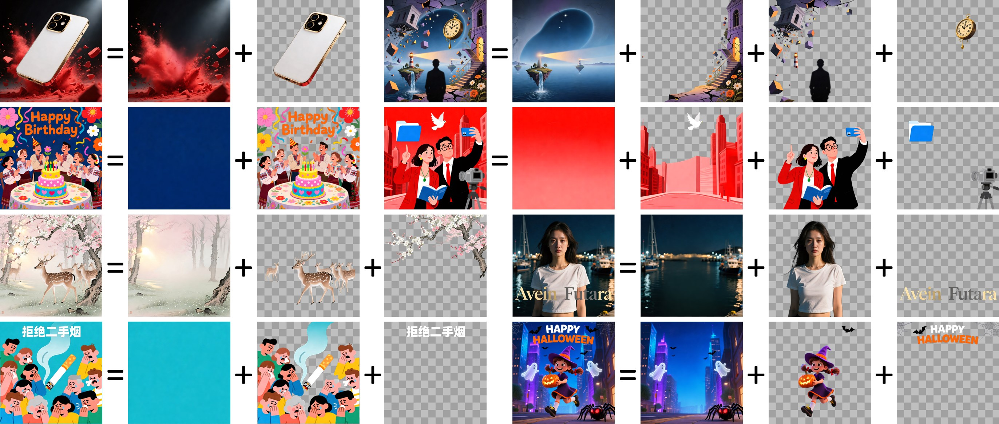

# #1-4-4. Qwen Image Edit / Layered

이 실습에서는 Qwen 이미지 모델의 두 가지 강력한 기능을 다룹니다.

1. **Qwen Image Edit 2511**: 이미지 편집 전문 모델
2. **Qwen Image Layered**: 이미지를 여러 레이어로 분해하는 모델

***

## Part 1: Qwen Image Edit 2511

<figure><figcaption></figcaption></figure>

&#x20;_Qwen Image Edit 워크플로우 전체 구조_

### 소개

Qwen-Image-Edit-2511은 Qwen-Image의 2024년 11월 업데이트 버전으로, 이미지 편집에 특화된 모델입니다.

### 핵심 기능

#### 1. 이미지 드리프트 완화

* 편집 과정에서 원본 이미지의 의도하지 않은 변화 방지
* 지정된 영역만 정확하게 수정

#### 2. 캐릭터 일관성 향상

* 동일 인물의 특징을 여러 이미지에서 일관되게 유지
* 얼굴, 헤어스타일, 의상 등의 특징 보존

#### 3. 다중 인물 일관성

* 여러 사람이 등장하는 이미지에서 각 인물의 특징 유지
* 복잡한 장면 편집 가능

#### 4. 텍스트 렌더링 개선

* 이미지 내 텍스트의 정확한 생성 및 편집
* 다양한 폰트와 스타일 지원

<figure><figcaption></figcaption></figure>

&#x20;_다양한 ControlNet 입력 타입 (Canny, Depth, Inpaint)_

#### 5. 기하학적 추론 및 구성선 생성

* 이미지 내 객체의 공간적 관계 이해
* 원근법, 그림자, 조명 등을 고려한 편집

### 모델 준비

Qwen Image Edit 2511을 사용하기 위해 필요한 모델 파일:

| 모델                                               | 저장 경로                             | 다운로드 링크                                                                         |
| ------------------------------------------------ | --------------------------------- | ------------------------------------------------------------------------------- |
| qwen\_image\_edit\_2511\_bf16.safetensors        | ComfyUI/models/diffusion\_models/ | [Hugging Face](https://huggingface.co/Comfy-Org/qwen_image_edit_2511)           |
| qwen\_2.5\_vl\_7b\_fp8\_scaled.safetensors       | ComfyUI/models/text\_encoders/    | [Hugging Face](https://huggingface.co/Comfy-Org/qwen_2.5_vl_7b)                 |
| qwen\_image\_vae.safetensors                     | ComfyUI/models/vae/               | [Hugging Face](https://huggingface.co/Comfy-Org/qwen_image_vae)                 |
| (Optional) Qwen-Image-Edit-2511-Lightning-4steps | ComfyUI/models/loras/             | [Hugging Face](https://huggingface.co/Comfy-Org/qwen_image_edit_2511_lightning) |

**Optional Lightning LoRA**: 4-step 고속 생성을 위한 LoRA 모델

<figure><figcaption></figcaption></figure>

&#x20;_GGUF 버전 모델 로드 워크플로우_

### 실습: 이미지 편집

#### Step 1: 워크플로우 템플릿 로드

**방법 1: ComfyUI 템플릿 사용**

1. 좌측 상단 메뉴 → **템플릿 탐색**
2. "Qwen Image Edit" 검색 및 선택

**방법 2: JSON 워크플로우 로드**

1. 워크플로우 JSON 다운로드
2. ComfyUI에서 Load → JSON 파일 선택

#### Step 2: 모델 다운로드 및 경로 설정

1. 워크플로우 로드 시 모델 다운로드 다이얼로그 표시
2. **Download** 클릭하여 자동 다운로드
3. 각 모델 로드 노드에서 올바른 모델 선택 확인

#### Step 3: 편집할 이미지 준비

1. **Load Image** 노드에 편집할 이미지 업로드
2. 이미지 해상도 확인 (권장: 512x512 \~ 1024x1024)

#### Step 4: 편집 영역 지정

**마스크 노드 사용**:

* 우클릭 → Add Node → mask → Mask Editor
* 편집할 영역을 브러시로 마스킹
* 마스크 강도 조절 (0\~1)

**전체 이미지 편집**:

* 마스크 없이 전체 이미지에 편집 적용 가능

<figure><figcaption></figcaption></figure>

&#x20;_Inpaint 방식의 영역 편집 워크플로우_

#### Step 5: 편집 프롬프트 입력

편집할 내용을 구체적으로 설명합니다.

**예시 프롬프트**:

```
change the shirt color to red
```

```
add sunglasses to the person
```

```
replace the background with a beach scene
```

```
make the person smile
```

<figure><figcaption></figcaption></figure>

&#x20;_Canny ControlNet을 활용한 편집 워크플로우 예시_

#### Step 6: 파라미터 조정

* **Steps**: 편집 스텝 수 (기본값: 20)
* **CFG Scale**: 프롬프트 가이던스 강도 (기본값: 7.0)
* **Denoise**: 편집 강도 (0\~1, 기본값: 0.75)
  * 낮은 값: 원본 유지 강화
  * 높은 값: 더 큰 변화 허용

#### Step 7: 실행 및 결과 확인

1. **Queue Prompt** 클릭
2. 처리 완료 대기
3. 원본과 편집된 이미지 비교
4. 만족스럽지 않으면 프롬프트 또는 파라미터 조정 후 재실행

### 고급 기능: Lightning LoRA

빠른 생성을 위해 Lightning LoRA를 사용할 수 있습니다.

1. Lightning LoRA 모델 다운로드
2. **LoRA Loader** 노드 추가
3. `Qwen-Image-Edit-2511-Lightning-4steps` 선택
4. Steps를 4로 설정
5. 생성 속도 향상 (약 3\~5배 빠름)

***

## Part 2: Qwen Image Layered

<figure><figcaption></figcaption></figure>

&#x20;_이미지를 여러 독립 레이어로 분해하는 예시_

### 소개

Qwen-Image-Layered는 이미지를 여러 독립적인 RGBA 레이어로 분해하는 혁신적인 모델입니다.

### 핵심 기능

#### 1. 이미지를 여러 레이어로 분해

* 복잡한 이미지를 의미 있는 구성 요소로 분리
* 각 레이어는 투명도(알파 채널) 정보 포함

#### 2. 각 레이어 독립적으로 편집 가능

* 레이어별 개별 수정
* 다른 레이어에 영향 없이 특정 요소만 변경

#### 3. 재귀적 분해 지원

* 레이어를 다시 하위 레이어로 분해 가능
* 세밀한 편집을 위한 계층적 구조

#### 4. 배경/전경 분리

* 자동으로 배경과 전경 객체 분리
* 합성 작업에 유용

### 모델 준비

| 모델                                              | 저장 경로                             | 다운로드 링크                                                             |
| ----------------------------------------------- | --------------------------------- | ------------------------------------------------------------------- |
| qwen\_image\_layered\_bf16.safetensors (또는 fp8) | ComfyUI/models/diffusion\_models/ | [Hugging Face](https://huggingface.co/Comfy-Org/qwen_image_layered) |
| qwen\_2.5\_vl\_7b\_fp8\_scaled.safetensors      | ComfyUI/models/text\_encoders/    | [Hugging Face](https://huggingface.co/Comfy-Org/qwen_2.5_vl_7b)     |
| qwen\_image\_vae.safetensors                    | ComfyUI/models/vae/               | [Hugging Face](https://huggingface.co/Comfy-Org/qwen_image_vae)     |

**참고**: FP8 버전은 VRAM 사용량이 낮습니다.

### 실습: 이미지 레이어 분해

#### Step 1: 워크플로우 템플릿 로드

1. ComfyUI 좌측 상단 메뉴 → **템플릿 탐색**
2. "Qwen Image Layered" 검색 및 선택
3. 템플릿 로드

#### Step 2: 모델 다운로드 및 경로 설정

1. 모델 다운로드 다이얼로그에서 **Download** 클릭
2. 자동 다운로드 완료 대기
3. 각 모델 로드 노드 확인

#### Step 3: 분해할 이미지 준비

1. **Load Image** 노드에 분해할 이미지 업로드
2. 복잡한 장면을 가진 이미지 권장
   * 예: 여러 객체가 있는 이미지, 인물 + 배경, 복잡한 구성

#### Step 4: 분해 프롬프트 입력

분해할 레이어를 설명합니다.

**예시 프롬프트**:

```
separate the person and background
```

```
extract the main subject into layers
```

```
decompose into foreground, middle ground, and background
```

```
separate all objects in the image
```

#### Step 5: 파라미터 조정

* **Num Layers**: 생성할 레이어 수 (기본값: 3\~5)
* **Steps**: 분해 스텝 수 (기본값: 20)
* **CFG Scale**: 프롬프트 가이던스 강도

#### Step 6: 실행 및 결과 확인

1. **Queue Prompt** 클릭
2. 처리 완료 대기
3. 여러 RGBA 레이어로 분해된 결과 확인
4. 각 레이어는 투명 배경의 PNG 형식

#### Step 7: 레이어 활용

분해된 레이어를 다양하게 활용할 수 있습니다:

**1. 개별 편집**

* 각 레이어를 독립적으로 편집
* Qwen Image Edit으로 레이어별 수정

**2. 합성**

* 레이어 순서 변경
* 새로운 배경 삽입
* 레이어별 효과 적용

**3. 재분해**

* 특정 레이어를 다시 하위 레이어로 분해
* 더 세밀한 편집

### 고급 활용: 레이어 기반 워크플로우

#### 예시: 배경 교체 워크플로우

```
원본 이미지
  ↓
Qwen Image Layered (전경/배경 분리)
  ↓
[전경 레이어] + [새 배경 생성]
  ↓
레이어 합성
  ↓
최종 이미지
```

#### 예시: 객체별 스타일 변경

```
원본 이미지
  ↓
Qwen Image Layered (객체별 분리)
  ↓
레이어 1: Qwen Image Edit (스타일 A 적용)
레이어 2: Qwen Image Edit (스타일 B 적용)
레이어 3: 원본 유지
  ↓
레이어 합성
  ↓
최종 이미지
```

***

## 두 모델의 조합 활용

Qwen Image Edit과 Qwen Image Layered를 함께 사용하면 더욱 강력한 편집이 가능합니다.

### 워크플로우 예시

```
1. Qwen Image Layered로 이미지 분해
   ↓
2. 각 레이어를 Qwen Image Edit로 개별 편집
   ↓
3. 편집된 레이어들을 다시 합성
   ↓
4. 최종 이미지 출력
```

### 실제 활용 사례

**케이스 1: 인물 사진 배경 교체**

1. Layered로 인물과 배경 분리
2. 배경 레이어를 Image Edit로 새로운 장면으로 변경
3. 인물 레이어는 유지
4. 합성

**케이스 2: 복잡한 객체 편집**

1. Layered로 각 객체 분리
2. 특정 객체만 Image Edit로 색상/스타일 변경
3. 나머지 객체는 원본 유지
4. 합성

**케이스 3: 재조명 효과**

1. Layered로 전경/중경/배경 분리
2. 각 레이어에 Image Edit로 조명 효과 적용
3. 깊이감 있는 조명 연출

***

## 트러블슈팅

### 문제: 레이어 분해가 정확하지 않음

**해결책**:

* 프롬프트를 더 구체적으로 작성
* Num Layers 조정
* 이미지 해상도 확인 (너무 낮으면 분해 품질 저하)

### 문제: 편집이 원본과 너무 다름

**해결책**:

* Denoise 값을 낮춤 (0.5\~0.7)
* CFG Scale 조정
* 프롬프트를 더 명확하게 작성

### 문제: VRAM 부족

**해결책**:

* FP8 양자화 모델 사용
* 이미지 해상도 낮추기
* 레이어 수 줄이기

***

## 참조

* ComfyUI Wiki - Qwen Image: https://comfyui-wiki.com/ko/tutorial/advanced/image/qwen/qwen-image
* ComfyUI Wiki - Qwen Image Layered: https://comfyui-wiki.com/ko/tutorial/advanced/image/qwen/qwen-image-layered
* Hugging Face - Qwen Image Models: https://huggingface.co/Comfy-Org
* Qwen Official Documentation: https://qwen.readthedocs.io/
