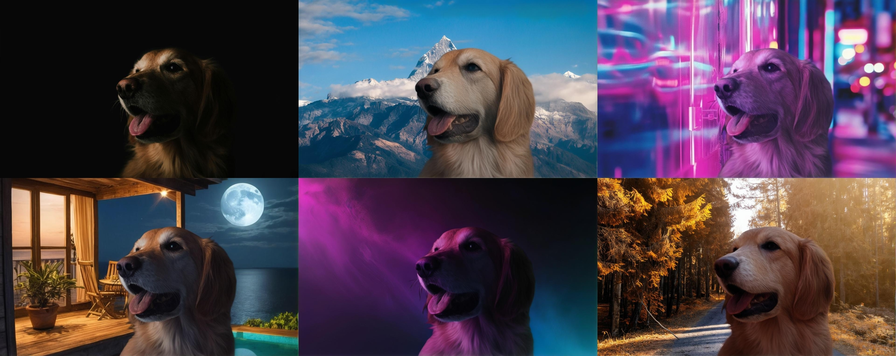
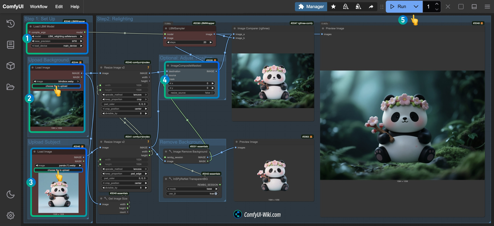

# #1-4-5. Image Relighting

## LBM(Latent Bridge Matching) 소개

&#x20;_LBM Relighting으로 피사체의 조명을 배경 환경에 맞게 자연스럽게 변환한 예시_

<figure><figcaption></figcaption></figure>

LBM은 잠재 공간의 Bridge Matching을 활용하여 빠른 이미지 변환을 지원하는 기술입니다.

### 주요 특징

* **단일 추론 단계**: 단일 추론 단계에서도 뛰어난 효율성을 발휘합니다
* **자연스러운 융합**: 전경 객체의 조명 효과를 새로운 배경 환경과 자연스럽게 융합합니다
* **빠른 처리**: 기존 확산 모델 대비 현저히 빠른 처리 속도를 제공합니다

### LBM이 해결하는 핵심 문제

1. **계산 효율성**: 기존 확산 모델의 반복적 계산 과정을 극적으로 줄입니다
2. **속도-품질 Trade-off**: 빠른 속도와 높은 품질을 동시에 달성합니다
3. **확장성**: 고해상도 이미지에도 효과적으로 적용 가능합니다

## 실습 준비

### 커스텀 노드 설치

다음 커스텀 노드들을 설치해야 합니다:

* **ComfyUI-LBMWrapper**: LBM 메인 노드
* **ComfyUI-KJNodes**: 이미지 크기 조정용
* **ComfyUI\_essentials**: 배경 제거용
* **rgthree-comfy**: Compare 노드 (결과 비교용)

### 모델 다운로드

Model Manager에서 "lbm" 검색 → `LBM_relighting.safetensors` 다운로드

## 실습: Image Relighting

### Step-by-step 진행

1. **워크플로우 준비**
   * 워크플로우 JSON 다운로드 후 ComfyUI에 로드
   * 또는 [comfyui-wiki.com](https://comfyui-wiki.com/ko/tutorial/advanced/image/relighting/lbm-relighting) 참조

&#x20;_ComfyUI에서의 LBM Relighting 워크플로우 전체 구성_

<figure><figcaption></figcaption></figure>

2. **커스텀 노드 설치**
   * Comfy Manager → Custom Nodes Manager
   * 위 노드들 검색 및 설치
   * ComfyUI 재시작
3. **모델 다운로드**
   * Model Manager → "lbm" 검색
   * `LBM_relighting.safetensors` 다운로드
4. **모델 로드 확인**
   * Load LBM Model 노드에서 `LBM_relighting.safetensors` 로드 확인
5. **배경 이미지 업로드**
   * Upload Background 그룹의 Load Image 노드에 배경 이미지 업로드

&#x20;_배경 이미지 예시 - 새로운 조명 환경을 제공하는 배경_

<figure><figcaption></figcaption></figure>

6. **피사체 이미지 업로드**
   * Upload Subject 그룹의 Load Image 노드에 피사체(전경) 이미지 업로드

&#x20;_피사체(전경) 이미지 예시 - 조명이 변경될 대상_

<figure><figcaption></figcaption></figure>

7. **합성 위치 조정 (선택사항)**
   * ImageCompositeMasked 노드의 xy 위치에서 합성 위치 조정
8. **이미지 크기 설정**
   * Resize Image v2 노드의 Width/Height 설정
   * 예: 1000 x 700
9. **실행**
   * 실행 버튼 클릭
   * g4dn 인스턴스 기준 약 1분 30초 소요
10. **결과 확인**
    * 이미지 미리보기 확인
    * Image Comparer로 원본 대비 결과 비교

&#x20;_LBM Relighting 전체 단계별 가이드_

<figure><figcaption></figcaption></figure>

## 활용 사례

### 영화/VFX

* 실시간 장면 조명 조정
* 포스트 프로덕션 시간 단축

### 이커머스

* 다양한 환경에 제품을 자연스럽게 배치
* 스튜디오 촬영 없이 여러 배경 연출

### 인테리어 디자인

* 다양한 조명 조건 시뮬레이션
* 시간대별 조명 효과 미리보기

## 참조

* [ComfyUI Wiki - LBM Relighting](https://comfyui-wiki.com/ko/tutorial/advanced/image/relighting/lbm-relighting)
