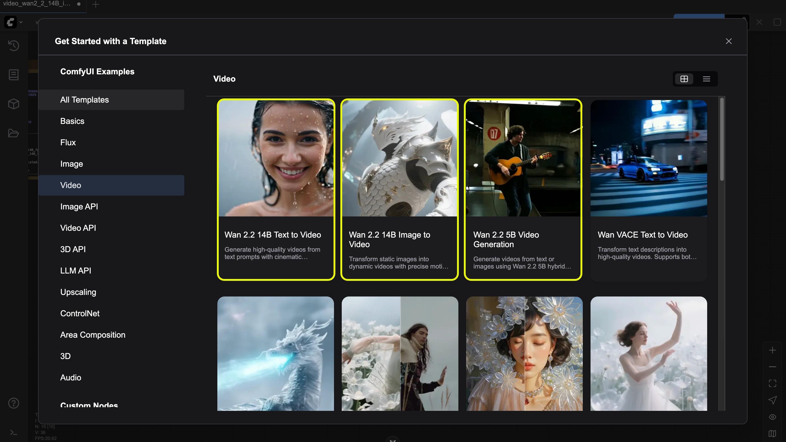
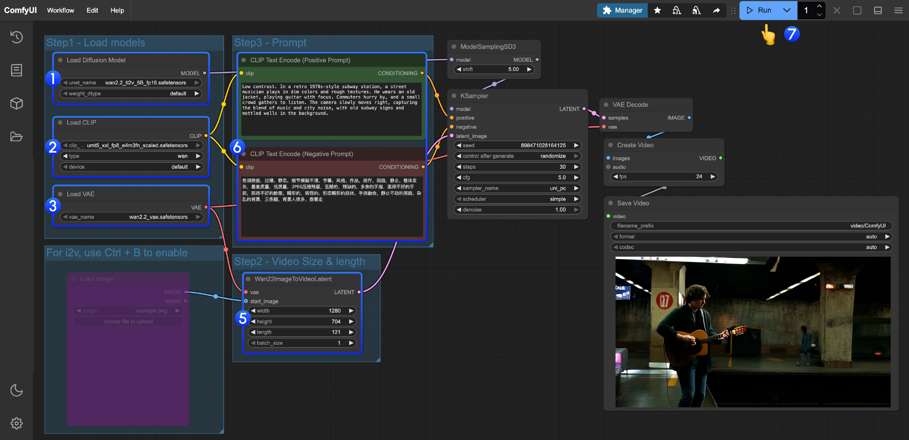
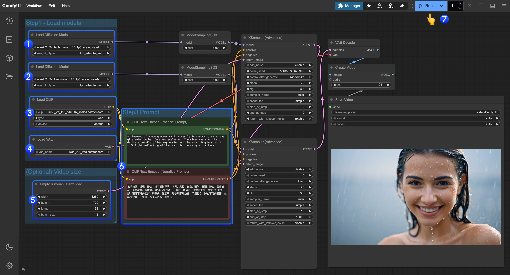
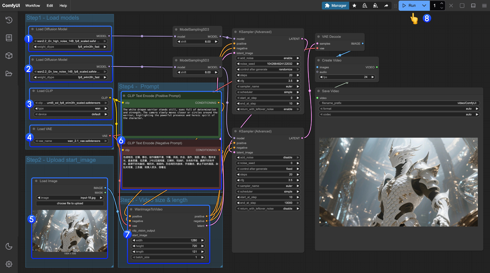
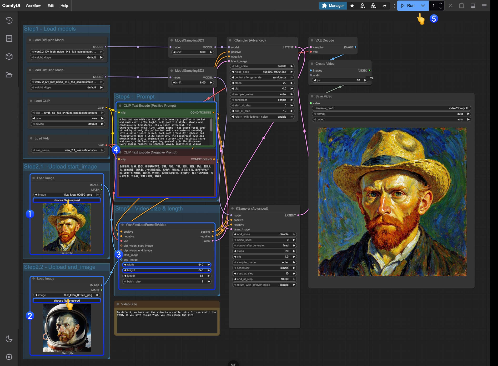

# #1-4-6. Wan 2.2 (Optional)

## 학습 목표
이 실습을 완료하면 다음을 할 수 있습니다:
- Wan 2.2 비디오 생성 모델의 특징과 버전별 차이점 이해하기
- Text-to-Video(T2V) 워크플로우를 구성하고 실행하기
- Image-to-Video(I2V)로 정지 이미지에 모션 추가하기
- 비디오 생성 프롬프트 작성 요령 익히기

## 소요 시간
약 20분 (모델 다운로드 제외)

## 난이도
★★★ (고급)

> **주의**: 이 실습은 **비디오 생성**을 다룹니다. 이미지 생성보다 **훨씬 많은 리소스**(VRAM, 처리 시간)가 필요합니다. 저사양 환경에서는 실행이 어려울 수 있으니 선택적으로 진행하세요.

## Wan 2.2 소개

Wan 2.2는 MoE(Mixture of Experts) 아키텍처 기반의 비디오 생성 모델입니다.

### 주요 특징

* **영화적 제어**: 영화 수준의 비디오 생성 및 정밀한 제어 가능
* **복잡한 모션 생성**: 다양하고 복잡한 모션 패턴 생성 지원
* **Apache 2.0 License**: 상업적 이용 가능
* **다목적 지원**: Text-to-Video 및 Image-to-Video 모두 지원

## 모델 버전 비교

| 모델              | 파라미터     | 기능                | VRAM 요구사항 |
| --------------- | -------- | ----------------- | --------- |
| Wan2.2-TI2V-5B  | 5B (MoE) | T2V + I2V 하이브리드   | \~8GB     |
| Wan2.2-T2V-A14B | 14B      | Text-to-Video 전문  | 높음        |
| Wan2.2-I2V-A14B | 14B      | Image-to-Video 전문 | 높음        |

## 모델 준비

다음 모델 파일들이 필요합니다:

| 모델 파일                                      | 용도           | 권장사항      |
| ------------------------------------------ | ------------ | --------- |
| Wan2.2 diffusion model                     | 메인 모델        | fp8 버전 권장 |
| umt5\_xxl\_fp8\_e4m3fn\_scaled.safetensors | Text Encoder | 필수        |
| wan2.2\_vae.safetensors                    | VAE          | 필수        |

## 실습 1: Text-to-Video

### Step-by-step 진행

1. **템플릿 선택**
   * ComfyUI 템플릿 탐색 → Video → "Wan 2.2" 관련 템플릿 선택
   * 또는 워크플로우 JSON 직접 로드

2. **모델 다운로드**
   * ComfyUI Manager → Model Manager
   * Filter: In Workflow
   * 모든 필요한 모델 선택 → Install
3. **UNet 모델 로드**
   * UNet 모델 로드 노드에서 Wan2.2 diffusion 모델 선택
4. **CLIP 모델 로드**
   * CLIP 모델 로드 노드에서 text encoder 선택
   * `umt5_xxl_fp8_e4m3fn_scaled.safetensors` 사용
5. **VAE 모델 로드**
   * VAE 모델 로드 노드에서 `wan2.2_vae.safetensors` 선택
6. **프롬프트 입력**
   * 예시: "A golden retriever running through a meadow, cinematic lighting, slow motion"
   * 영어로 작성하며 구체적일수록 좋은 결과
7. **비디오 파라미터 설정**
   * Width: 비디오 가로 크기 (예: 1024)
   * Height: 비디오 세로 크기 (예: 576)
   * Frame 수: 생성할 프레임 개수 (예: 81)
8. **실행**
   * 실행 버튼 클릭
   * g4dn 인스턴스 기준 약 5분 소요
9. **결과 확인**
   * 대기열 탭에서 진행 상황 확인
   * 생성 완료 후 비디오 미리보기
10. **다운로드**
    * 결과 비디오를 로컬에 다운로드하여 확인

### Wan2.2 5B T2V 워크플로우

### Wan2.2 14B T2V 워크플로우

## 실습 2: Image-to-Video (선택사항)

### Step-by-step 진행

1. **I2V 워크플로우 로드**
   * Image-to-Video 전용 템플릿 또는 워크플로우 JSON 로드
2. **참조 이미지 업로드**
   * Load Image 노드에 시작 프레임으로 사용할 이미지 업로드
3. **프롬프트 입력**
   * 원하는 모션과 효과를 설명하는 프롬프트 작성
   * 예: "The character slowly turns their head to the left, cinematic"
4. **실행 및 결과 확인**
   * 실행 후 이미지가 어떻게 움직이는지 확인

### Wan2.2 14B I2V 워크플로우

### Wan2.2 14B 시작-종료 프레임 워크플로우

## 비디오 생성 팁

### 프롬프트 작성 팁

* 구체적인 동작 설명: "walking slowly", "running fast" 등
* 카메라 움직임: "camera panning right", "zoom in" 등
* 조명 및 분위기: "golden hour lighting", "dramatic shadows" 등
* 영화적 효과: "cinematic", "slow motion", "depth of field" 등

### 파라미터 조정 가이드

* **낮은 해상도**: 빠른 테스트용 (512x288)
* **중간 해상도**: 일반적인 결과물 (1024x576)
* **높은 해상도**: 최종 결과물 (1280x720 이상, VRAM 주의)

> **초보자 팁**: 비디오 생성은 시간이 오래 걸립니다. 처음에는 낮은 해상도(512x288)와 적은 프레임 수(예: 49프레임)로 테스트하여 프롬프트와 설정을 실험해보세요. 만족스러운 결과가 나오면 그때 해상도와 프레임을 올려서 최종 버전을 생성하세요.

## 진행 확인

다음 항목을 완료했는지 체크하세요:

- [ ] Wan 2.2 모델의 3가지 버전(5B, 14B T2V, 14B I2V)의 차이를 이해했다
- [ ] 필요한 모델 파일(diffusion model, text encoder, VAE)을 모두 다운로드했다
- [ ] Text-to-Video 워크플로우를 로드하고 비디오를 생성했다
- [ ] 다양한 프롬프트를 시도하며 영화적 효과(조명, 카메라 움직임 등)를 실험했다
- [ ] (선택) Image-to-Video 워크플로우를 시도했다

## 참조

* [ComfyUI Wiki - Wan 2.2](https://comfyui-wiki.com/ko/tutorial/advanced/video/wan2.2/wan2-2)

> 이미지 출처: [ComfyUI Wiki](https://comfyui-wiki.com)
